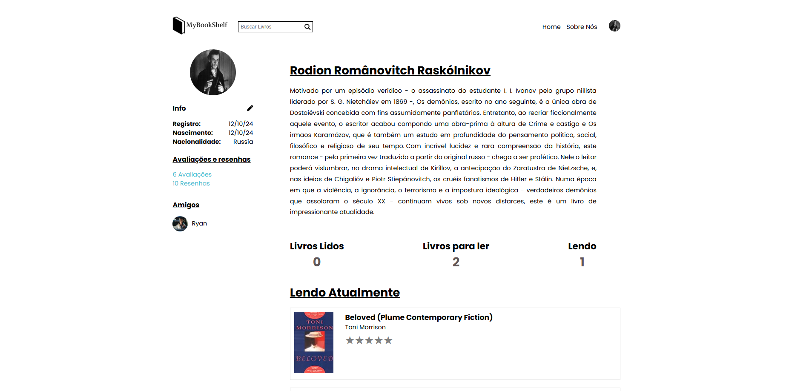

# MyBookShelf

  
*Plataforma de catalogação social para entusiastas da literatura.*

---

## Visão Geral do Projeto

**MyBookShelf** é uma plataforma de catalogação social desenvolvida para entusiastas da literatura de todos os níveis, desde leitores casuais até um público mais acadêmico. A plataforma permite que os usuários registrem suas leituras, compartilhem opiniões, criem listas personalizadas e planejem futuras leituras de maneira intuitiva e organizada. Além disso, os usuários podem interagir com outros membros da comunidade, visualizar perfis e listas de leituras, e explorar recomendações personalizadas.

---


## Tecnologias Utilizadas

### Front-End
- **React com TypeScript**: Para uma interface moderna e tipagem estática.
- **Bibliotecas de UI**: Componentes reutilizáveis e responsivos.

### Back-End
- **Node.js com Express**: Para construção da API RESTful.
- **Autenticação**: JWT (JSON Web Tokens) para segurança.

### Banco de Dados
- **MongoDB**: Armazenamento de dados não estruturados e escalável.

### APIs Externas
- **Open Library API**: Para complementar informações bibliográficas.

---

## Mockups e Imagens

### Landing Page


### Catálogo de Livros


### Página do Livro


### Perfil do Usuário


---

## Como Executar o Projeto

1. **Clone o repositório**:
   ```bash
   git clone https://github.com/seu-usuario/mybookshelf.git
   cd mybookshelf

2. **Clone o repositório**:
   ```bash
   npm install

3. **Configure as variáveis de ambiente**:
   ```bash
   PORT="PORT HERE"
    JWT_SECRET="JWT HERE"
    MONGODB_URL="MONGO DB URL"

    CLOUDINARY_CLOUD_NAME="cloud_name"
    CLOUDINARY_API_KEY="api_key"
    CLOUDINARY_API_SECRET="api_secret"

4. **Inicie o servidor**:
   ```bash
   npm start

5. **Acesse a aplicação**:

Abra o navegador e acesse http://localhost:3000.

---

## FrontEnd

https://github.com/Erne1984/MyBookShelf
